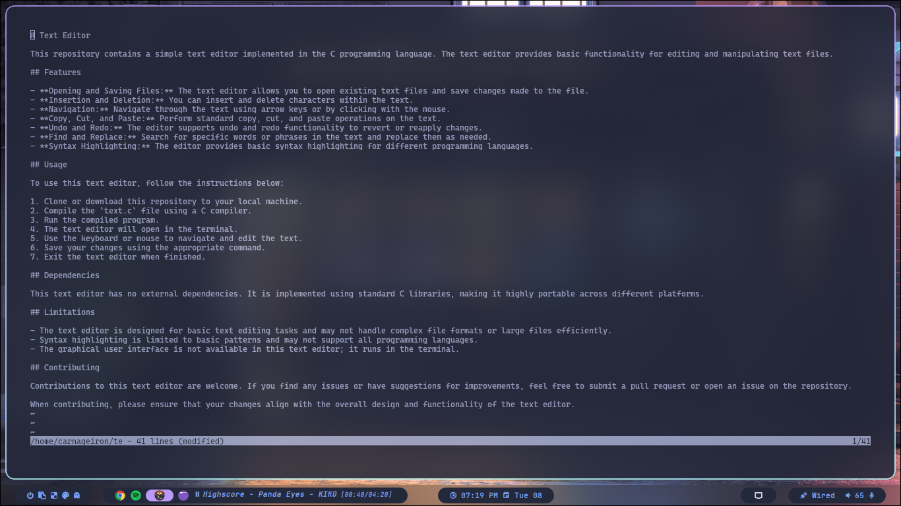

# Text Editor

This repository contains a simple text editor implemented in the C programming language. The text editor provides basic functionality for editing and manipulating text files.

## Features

- **Opening and Saving Files:** The text editor allows you to open existing text files and save changes made to the file.
- **Insertion and Deletion:** You can insert and delete characters within the text.
- **Navigation:** Navigate through the text using arrow keys or by clicking with the mouse.
- **Copy, Cut, and Paste:** Perform standard copy, cut, and paste operations on the text.
- **Undo and Redo:** The editor supports undo and redo functionality to revert or reapply changes.
- **Find and Replace:** Search for specific words or phrases in the text and replace them as needed.
- **Syntax Highlighting:** The editor provides basic syntax highlighting for different programming languages.

## Usage

To use this text editor, follow the instructions below:

1. Clone or download this repository to your local machine.
2. Compile the `text.c` file using a C compiler.
3. Run the compiled program.
4. The text editor will open in the terminal.
5. Use the keyboard to navigate and edit the text.
6. Save your changes using the appropriate command.
7. Exit the text editor when finished.

## Dependencies

This text editor has no external dependencies. It is implemented using standard C libraries, making it highly portable across different platforms.

## Limitations

- The text editor is designed for basic text editing tasks and may not handle complex file formats or large files efficiently.
- Syntax highlighting is limited to basic patterns and may not support all programming languages.
- The graphical user interface is not available in this text editor; it runs in the terminal.

## Contributing

Contributions to this text editor are welcome. If you find any issues or have suggestions for improvements, feel free to submit a pull request or open an issue on the repository.

When contributing, please ensure that your changes align with the overall design and functionality of the text editor.
